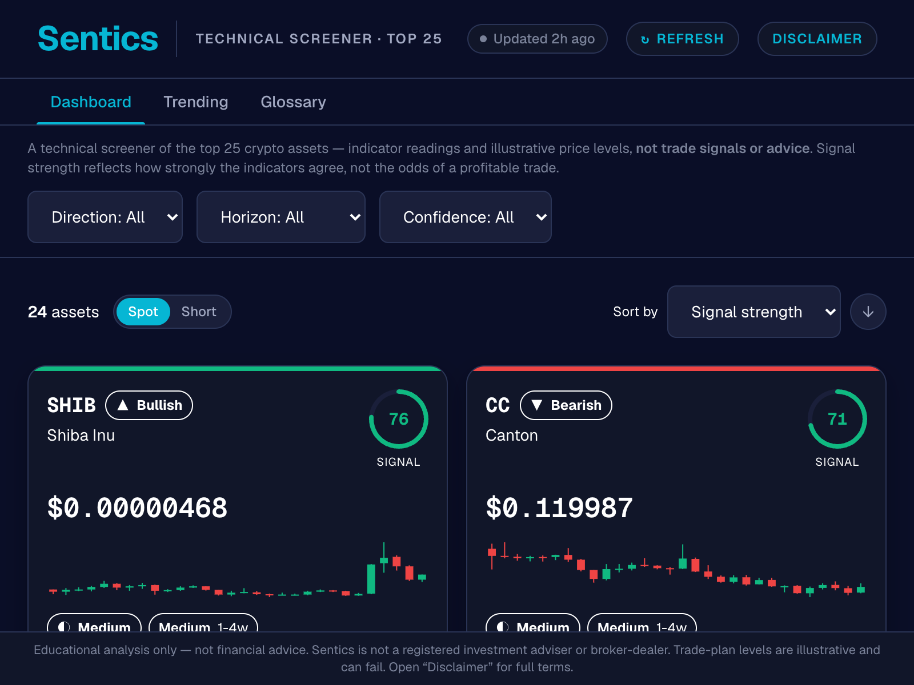
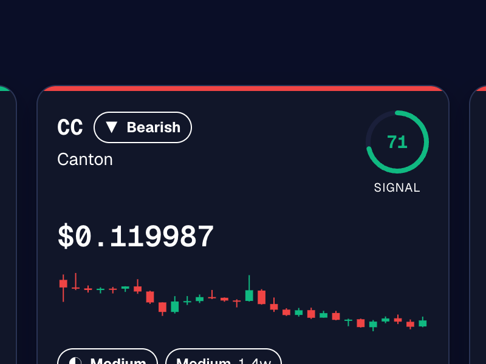
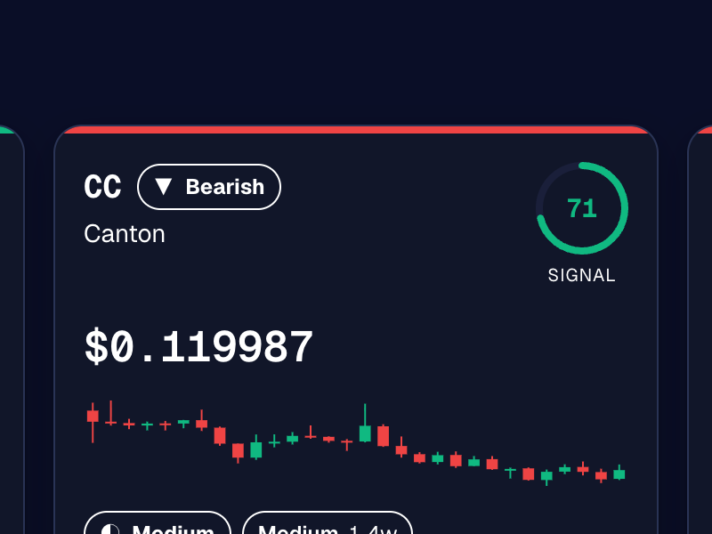
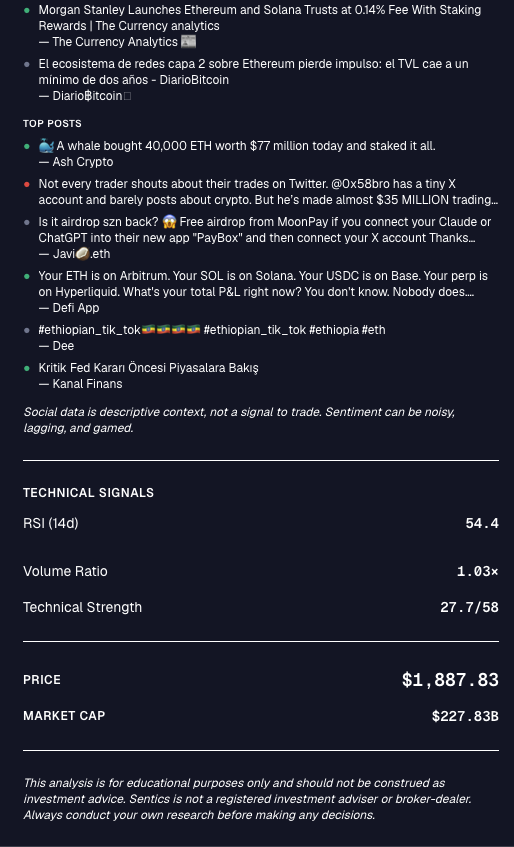
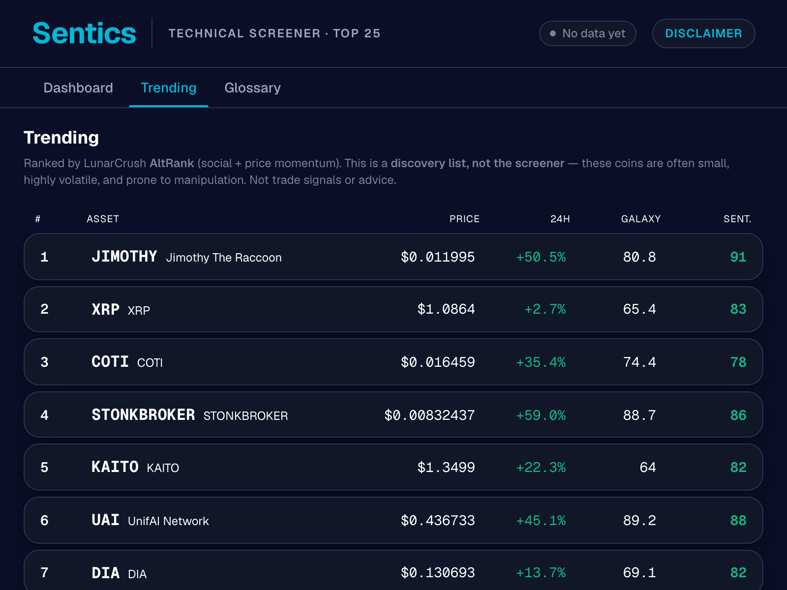
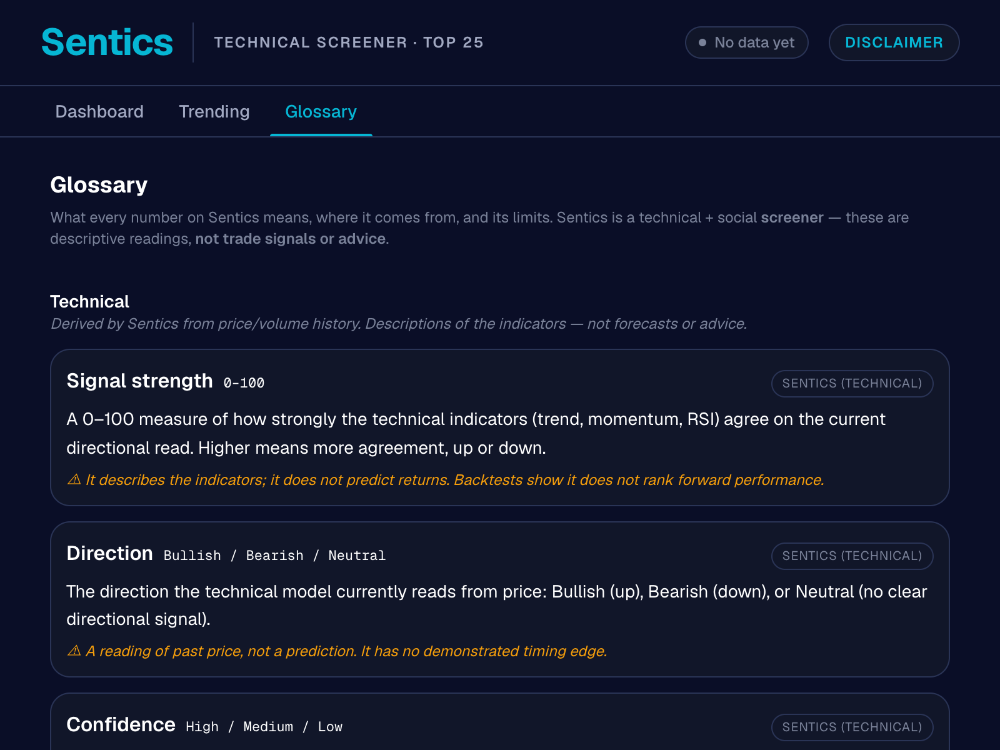

# Sentics — Crypto Technical & Social Screener

A full-stack crypto screener that combines technical analysis signals with LunarCrush social data to surface momentum candidates. Built as a personal research project to explore whether quantifiable edges exist in crypto markets.



## Features

### Dashboard — Signal Strength Screener
The main view ranks the top 25 crypto assets by a composite signal score (0–100) derived from technical indicators: RSI, MACD, Bollinger Bands, volume surge, and a 100-day SMA trend filter. Each card shows direction (Bullish/Bearish), a visual score ring, mini candlestick chart (linked to TradingView), and a compact trade plan.

### Coin Detail Drawer
Click any card to open a full analysis panel: entry/target/stop prices with R/R ratio, all contributing technical signals, social sentiment metrics (galaxy score, AltRank, platform breakdown), and a contrarian tilt disclosure when social sentiment is extreme.







### Trending — Social Discovery
LunarCrush AltRank-ranked list for discovering coins gaining social momentum before price moves. Distinct from the TA screener — a separate signal layer.



### Glossary — KPI Reference
Definitions for every metric displayed in the app, grouped by category (Technical, Trade Levels, Social, Market). Useful for understanding exactly what each number represents and how it's calculated.



## What the Data Actually Showed

This project was built honestly — with a validation ledger and out-of-sample backtests from the start.

**One confirmed edge:** The 100-day SMA trend filter beats buy-and-hold on BTC and ETH out-of-sample, primarily through drawdown reduction (~−40% max drawdown vs ~−77% for B&H on BTC). The whole 50–200 day SMA family works, which means it's not overfit to a single parameter.

**The directional signal model had no edge** — the live call ledger showed a t-stat of −7 at 7d and −4.7 at 30d. The pipeline was disabled rather than left running.

**Social contrarian tilt worked** in backtest (t −2.4 to −3.4 across horizons, OOS consistent) and is wired as a small conviction adjustment (±~3 pts). Too small to be the core signal.

## Tech Stack

| Layer | Technology |
|---|---|
| Frontend | Next.js 16, Tailwind v4, TypeScript |
| Backend | FastAPI (Python), Vercel serverless |
| Database | Supabase (PostgreSQL) |
| Cache | Redis (12h OHLCV TTL) |
| Market data | CoinGecko free tier |
| Social data | LunarCrush Builder API |
| Charts | Hand-rolled SVG candlesticks |
| Monitoring | Token-gated `/status` digest + CLI script |

## Architecture

```
sentics-sti (Next.js frontend)   →   sentics-agents (FastAPI backend)
                                            │
                              ┌─────────────┼─────────────┐
                         CoinGecko    LunarCrush      Supabase
                         (OHLCV)      (social)        (ledger)
```

The agent pipeline runs on-demand: Agent 1 scores category momentum, Agent 2 applies TA filters and social tilt, Agent 3 synthesizes rationale. A call-snapshot ledger tracks every directional call for forward validation — leak-free (no future data in the entry price).

## Local Development

```bash
npm install
npm run dev
```

Requires a `.env.local` with `SUPABASE_URL`, `SUPABASE_SECRET_KEY`, `LUNARCRUSH_API_KEY`, `ANTHROPIC_API_KEY`, and `REDIS_URL`.

To run the TA backtest:

```bash
python3 api/scripts/strategy_backtest.py --coin btc --cost-bps 10 --oos 0.35
```

## Live App

[sentics-sti.vercel.app](https://sentics-sti.vercel.app)
